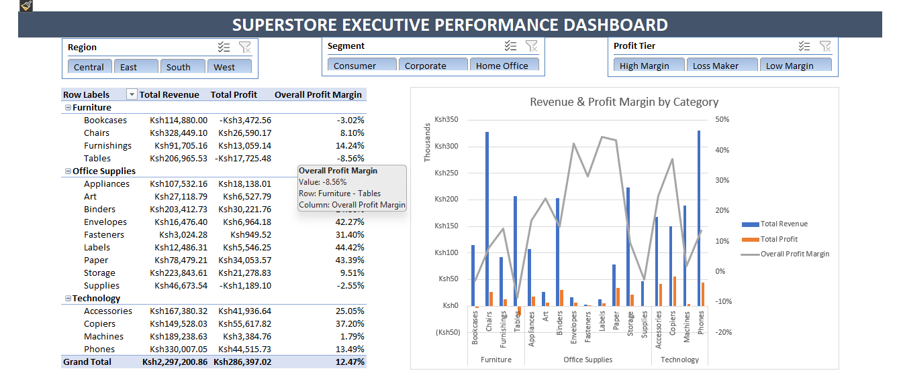

# Superstore Commercial Sales & Profitability Analytics Dashboard
## Executive Dashboard Preview


---
An end-to-end executive sales and margin analytics solution built using **Microsoft Excel**, **Power Query**, **Power Pivot**, and **Data Analysis Expressions (DAX)**. This interactive dashboard transitions raw transactional data into a robust relational Data Model, enabling dynamic business KPI tracking, product tiering, and margin optimization analysis.
---

---

## Project Overview & Problem Statement

The Superstore sales dataset contains transactional records spanning multiple product categories, customer segments, and geographic regions. Managing and analyzing this data using traditional static formulas (`SUMIFS`, `VLOOKUP`) created performance bottlenecks and limited interactive drill-down capabilities.

### Key Objectives:
* Cleanse, transform, and parse transactional datasets with inconsistent date locales.
* Transition raw data tables into a scalable Data Model using Power Pivot.
* Create explicit DAX measures for Revenue, Profit, and Profit Margin to compute metrics dynamically across filtered contexts.
* Design an executive interactive dashboard with custom multi-column slicers and dual-axis visualization.
* Uncover key bottom-line profitability drivers and revenue-versus-margin discrepancies.

---

## Tech Stack & Methods Used

* **Business Intelligence / Analytics Tool:** Microsoft Excel
* **ETL & Data Transformation:** Power Query (M Language)
* **Data Modeling & Analytics:** Power Pivot, DAX (Data Analysis Expressions)
* **Visualizations & Layout:** Pivot Tables, Pivot Charts (Dual-Axis Combo), Slicers, UI Grid Alignment

---

## Project Architecture & Workflow Phases

### Phase 1: Data Preprocessing & Cleaning (Power Query)
* **Locale & Date Parsing:** Standardized mixed date strings into `DD/MM/YYYY` format to prevent date calculation errors.
* **Calculated Fields:**
  * `Shipping Days` = `[Ship Date] - [Order Date]`
  * `Profit Margin (%)` = `[Profit] / [Sales]`
  * `Profit Tier` = Conditional classification logic (`Loss Maker`, `Low Margin`, `High Margin`).
* **Table Staging:** Loaded transformed output as `tbl_Superstore`.

### Phase 2: Summary Metrics & Lookup Automation
* Formatted summary KPI tables utilizing structured formulas (`SUMIFS`, `AVERAGEIFS`, `COUNTIFS`).
* Integrated an automated product search interface using `XLOOKUP` to retrieve exact item attributes by `Product ID`.

### Phase 3: Data Modeling & Explicit DAX Measures (Power Pivot)
* Ingested `tbl_Superstore` into the Excel Data Model.
* Engineered explicit DAX measures in the Power Pivot Calculation Area:

```dax
-- Total Revenue Metric
Total Revenue := SUM('Sample Superstore'[Sales])

-- Total Profit Metric
Total Profit := SUM('Sample Superstore'[Profit])

-- Dynamic Overall Profit Margin
Overall Profit Margin := DIVIDE([Total Profit], [Total Revenue], 0)
